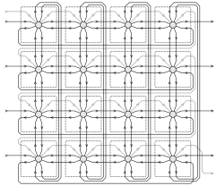

  

# ROTFPGA v2

A reconfigurable logic circuit built from identical copies of the tile above containing a NAND gate,
a D flip-flop and a buffer, with each tile individually rotated or reflected as described by the FPGA
configuration. Port of the original [ROTFPGA](https://github.com/htfab/rotfpga)
from Caravel to TinyTapeout.

Porting the design required a 50-fold decrease in chip area which was achieved using a combination of
cutting corners, heavy optimization and a few design changes. In particular:
- The FPGA was reduced from 24×24 to 8×8 tiles.
  There are 8 inputs and 8 outputs instead of 12 each.
- To compensate for smaller size, tiles can also be mirrored in addition to rotation.
- Tiles (being the most repeated part of the design) were rewritten as hand-optimized
  gate-level Verilog.
- Each tile only contains 1 flip-flop (the one exposed to the user). Configuration is
  now stored in latches.
- Configuration and reset are performed using a routing-efficient scan chain, so the design
  is no longer routing constrained. This allows standard cells to be placed with >80% density.
- Openlane and its components are 2 years more mature, hardening the same HDL more efficiently.

## Configuration

Each tile can be configured in 8 possible orientations. Bits 0, 1 and 2 correspond to a diagonal, horizontal
and vertical flip respectively. Any rotation or reflection can be described as a combination:

(The bottom row looks somewhat different, but we just rearranged the wires so that the inputs and outputs
line up with the unmirrored tiles.)

Tiles are arranged in an 8×8 grid:
- Top, bottom, left and right inputs and outputs are connected to the tile in the respective direction.
- Tiles mostly wrap around, e.g. the bottom output of a cell in the last line connects to the top input
  of the cell in the first line.
- As an exception to the wrapping rules, left inputs in the first column correspond to chip inputs and
  right outputs in the last column correspond to chip outputs.
- There is a scan chain meandering through all the tiles, visiting lines from top to bottom and within
  each line going from left to right.

This is a 4×4 model of the tile grid, showing regular i/o as black and the scan chain as grey:

When the _scan enable_ input is 0, the FPGA operates normally and each tile sets its flip-flop to
the input it receives from one of the neighboring tiles according to its current rotation/reflection.
When _scan enable_ is 1, it sets the flip-flop to the value received through the scan chain instead.
This allows us to set the initial state of each flip-flop and also to query their state later for
debugging. With some extra machinery it also allows us to change the rotations/reflections.

When the 2-bit _configuration_ input is is 01, each cell updates its _vertical flip_ bit to the
current value of its flip-flop. Similarly, for 10 it sets the _horizontal flip_ and for 11 it
sets the _diagonal flip_. When _configuration_ is 00, all three flip bits are latched and the
orientation doesn't change.

One can thus configure the FPGA by sending the sequence of all _diagonal flip_ bits through the
scan chain, then setting _configuration_ to 11 and back to 00, then sending all _horizontal flip_
bits, setting _configuration_ to 10 and back to 00, and finally sending the _vertical flip_ bits
and setting _configuration_ to 01 and back to 00.

Note that in order to save space the flip bits are stored in latches, not registers. Changing the
_configuration_ input from 00 to 11 or vice versa can cause a race condition where it is
temporarily 01 or 10, overwriting the horizontal or vertical flip bits. Therefore one should
configure the diagonal flips first.

## Loop breaker

The user design may intentionally or inadvertantly contain combinational loops such as ring
oscillators. To help debug such designs, the chip has a loop breaker mechanism using
a _loop breaker enable_ input as well as a 2-bit _loop breaker class_ input.

Tiles are assigned to loop breaker classes:

The loop breaker latches a tile output if and only if the following conditions are all met:
- The _loop breaker enable_ input is 1.
- The current tile has a non-empty class that is different from the _loop breaker class_ input.
- The output doesn't come from the tile's flip-flop.

The loop breaker has the following properties:
- If _loop breaker enable_ is 1 and _loop breaker class_ is constant, there are no combinational
  loops running. If we also pause the clock, the circuit keeps a steady state.
- If _loop breaker enable_ is 1 and we cycle _loop breaker class_ through all possible
  values repeatedly while the clock is paused, everything will eventually propagate.
  If we also assume that the design has no race conditions, it will behave in the same
  way as if _loop breaker enable_ was 0.

## Reset

Setting the _active-low reset_ input to 0 has the following effect:
- Override _scan enable_ to 1, _scan chain_ input to 0 and disengage the latches for
  vertical, horizontal and diagonal flips. When kept low for 64 clock cycles this will reset
  the state and configuration in every tile.
- Override _loop breaker enable_ to 1 and _loop breaker class_ to 00.
  This ensures that we play nice with other designs on TinyTapeout and keep a steady
  state while our design is not selected.

## Pin mapping

Input pins:
- `clk` provides a clock signal for the flip-flops
- `rst_n` is the _active-low reset_ described above
- `ui_in[7:0]` are passed to the leftmost column of tiles as inputs from the left

Output pins:
- `uo_out[7:0]` come from the rightwards output of the rightmost column of tiles

Bidirectional pins:
- `uio_in[0]` is the _scan enable_ input
- `uio_in[1]` is the _scan chain_ input
- `uio_in[3:2]` are the _configuration_ input bits
- `uio_in[4]` is the _loop breaker enable_ input
- `uio_in[6:5]` are the _loop breaker class_ input bits
- `uio_out[7]` is the _scan chain_ output
